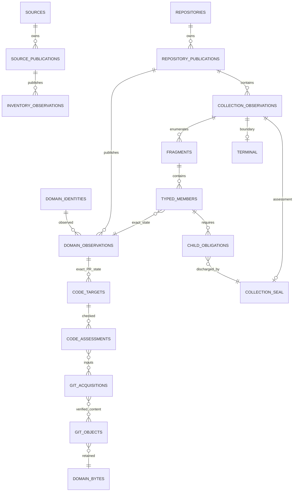
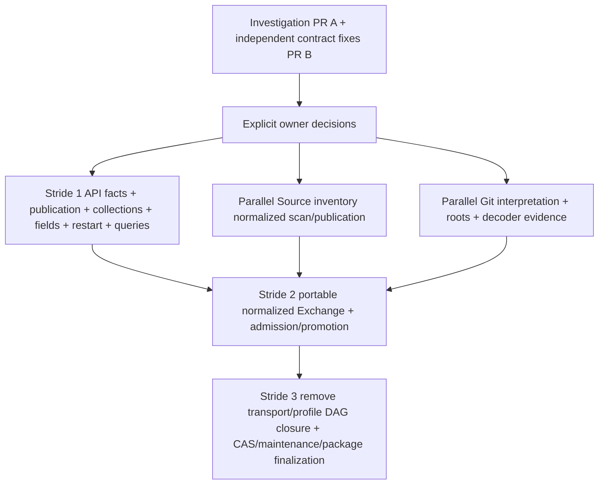

# Phase 2 integrated architectural proposal

**Status: Proposed / Pending Owner Decision.** This is an investigated target
architecture, not an accepted replacement schema. Opening this PR, passing its
checks, or merging documentation would not approve unresolved choices. Production
remains Catalog3 schema 18 in this proposal. The separately submitted determined
implementation PR fixes existing contracts; it does not install this architecture.

## Verified baseline and authority

Fetched main on 2026-10-10: `20e0f8d78b77c6c8d37826fd6d639819631e166b`, tree
`003d276a6aeb6a1479232a1d0a1857db371cb623`. No open PRs existed at investigation start. The
initial `work` checkout was `7a3596236cdbf2a9ac39c5d12101c8a54c03673d`; it was left
intact. All investigations use fresh worktrees from fetched main, not that old
checkout or an assumed preparation SHA.

The exact packaged composition is `catalog3.sql`, `git_facts.sql`,
`cas_integrity.sql`, `exchange.sql`, `identity_relations.sql`,
`current_resources.sql`, `current_collections.sql`, `json_contracts.sql` through
[`schema.py`](../../src/repo_catalog/adapters/sqlite/schema.py). Executing it on
Python 3.12.14 / SQLite 3.53.1 yields **103 product tables, 665 columns, 226 FK
constraints, 48 views, 498 triggers and 106 explicit indexes**. Fingerprint:
`16110944d4b6a0942657644fe80383394210af1218a3e7111e331a1651fa211e`.
FTS virtual/shadow objects, SQLite internals and implicit indexes are separate.
All 48 views and 309 prepared product-table mutation shapes compile; fresh FK
and integrity checks pass. Preparing a statement is not executing a product path.

[AGENTS.md](../../AGENTS.md) defines authority order: explicit active owner
decisions/permissions, accepted ADRs/scoped supersessions, current surviving
contracts, then historical evidence.
The accepted [transport-independent ADR](../transport-independent-core-adr.md)
(TP-01–TP-08, 2026-10-10) and [Phase 1 retirement](../phase1-api-original-retirement.md)
(R1–R7, 2026-10-10 with scoped D/CAS supersessions) apply. The implementation-state
phrases in those original documentation checkpoints are not new runtime gates;
[Phase 1's implemented boundary](../phase1-api-original-retirement-implementation.md)
and merged PRs #19/#20/#21 establish today's state. The D1–D38 and CAS status
mapping in [model integration status](../model-integration-status.md) is a topic
register, not a numbered new Phase 2 ADR. Identity, epoch-microsecond, natural
document and Coverage decisions remain accepted. There is no new accepted Phase
2 lifecycle, publication, completeness, cache or Exchange policy.

## Accepted invariants, unchanged

1. Permanent repository UUIDv4; service and Source identities remain independent.
   Names, URLs and equivalence assertions never merge registrations.
2. Signed int64 Unix epoch microseconds, `_us` suffix, NULL where unknown is allowed;
   zero and negative values are real values.
3. Coverage claims keep **exactly** `coverage_claim_id`, `coverage_scope_id`,
   `coverage_state`, `observed_at_us`, `details_json`. Current state uses every
   candidate at the greatest actual observation time, never older complete fallback.
   Empty scopes are unknown with NULL observation; same-time unknown is weaker
   than a single nonunknown state; contradictory nonunknown states or receiver
   conflict barriers are conflict.
4. Document identity is `(change_request_id,kind,provider_change_request_document_id)`.
   No document surrogate/version identity or parser metadata in shared identity.
5. Exact UTF-8 text identity and verified SHA-1/SHA-256 raw Git bytes survive.
   Typed owners, parents and domain-content integrity remain mandatory.
6. Actual producing module/version and mixed per-field origins remain truthful.
   Missing, explicit null, empty and unchanged differ. Comparable provider clocks
   can order values; parser version, receipt/UUID order and parsing time cannot.
7. Incomparable or contradictory evidence cannot manufacture an undisputed winner.
   Issue transfer preserves captured provenance; receiver checks are local.
8. Partial collections cannot prove completeness. CAS-41 checks active physical
   quarantine in the verified copied database before restore diagnosis.
9. R1–R7 do not reappear via generic JSON, optional cache, staging, diagnostics,
   replacement publication or Exchange. Retrospective API parser replay stays retired.

## Evidence: live dependency chains, not grep conclusions

The [machine inventory](dependency-inventory.json) contains exact columns,
composite keys/FKs, generated columns, explicit/implicit indexes, SQL fingerprints,
SQLite-authorizer view/trigger dependencies, generated JSON registry equality,
reference vocabularies, actual CLI parser expansion and wire-column inventories.
Its compressed [source inventory](dependency-source.json.gz) contains all AST
functions/imports/call sites, locally resolved calls, literal object references,
SQL expressions and compiled/unresolved accesses. The compressed artifact is
repository code analysis, not an HTTP archive. Static references and EXPLAIN
accesses are labeled as such. Four SQL preparation failures are negative/derived
fixture SQL; unresolved dynamic SQL is retained, never classified as dead.

[Publication](workstreams/publication.md), [completeness](workstreams/completeness.md),
[acquisition](workstreams/acquisition.md), [fields](workstreams/fields.md) and
[Exchange/CAS](workstreams/exchange.md) independently trace entry points and tests.
These are the retained major chains:

| Producer → stores → actual consumer | Responsibility that survives | Why deletion is incorrect; minimum decision |
| --- | --- | --- |
| `sync pr/all`, jobs resume → `CollectionService._sync` → `GitHubCollector` → `ApiFacts.page/result/ownership/publish` → fetch/payload/byte rows, parsed inputs/publications, PR/doc/event/thread facts | Resource identities, exact text, owner/capture, admitted immutable observations and exact sealed output set | Direct result/fetch FKs and eligibility/publication guards fail or disappear. Replace domain publication Q04 plus affected lifecycle/selection Q01/Q02/Q08 and retained fields Q09. A fetch is not a domain observation or publication identity. |
| `source discover` / job discovery → accepted inventory inputs → `_publish_inventory` → Source result/publication and repository inventory/name observations | Authenticated principal/scope, Source-owned scan members, provider repository identity/name/endpoints and honest discovery completeness | Dropping inputs breaks Source-owner and eligibility guards; assigning repository ownership is wrong. Q03/Q04/Q05/Q09 must define Source publication and enumeration. Manual Git configuration proof is user-authored, not a response body. |
| Accepted flat list → `fetch_collections`, occurrences, memberships/current receipts, completion/incremental evidence → Coverage/query/`aggregate_proof` | Known member set, scope, actual clocks, terminal boundary, inherited baseline proof | A valid resource does not establish a complete list. Historical Exchange reparses saved arrays and compares PR payload projections. Q05/Q10 replace exact member/terminal closure. Current receipts already operate without saved originals. |
| GraphQL root/error prefix → root bytes + root/current receipts → pending root reconstruction, `_thread_children`, `saved_thread_code_input` | Typed thread/child targets, missing/null merge roles, original root times, required-child completeness, committed-prefix restart | Deleting roots loses child cursors/expected roles and can make incomplete trees complete. Q06/Q12 separate normalized obligations from operational continuation; Q04/Q05 provide durable ownership. |
| Live detail ETag → validator → 304 → stored bytes + selected PR projection → original completion anchor | Conditional confirmation of the exact earlier scoped observation, without inventing a fresh provider observation | Missing/mismatched A cannot confirm newer B. Q07 chooses unconditional fetch, disposable coherent cache, or normalized evidence revalidation. Validators are operational and excluded from Exchange. |
| PR observation + commit/file listings + observed Git roles → separate multi-input code result → code/current/target proof | Assessment of one exact head/base generation, required raw Git roots and complete lists | Replacing origin IDs with current PR would attach old code to changed head/base. Q06/Q08/Q09 specify typed target evidence; Q04/Q10 preserve exact dependencies and owner checks. |
| Git acquisition/raw objects → Git parsing → result-bound snapshots/refs/commits/trees/tags/text → selected eligible queries/search | Verified content, ordered parent/raw-name relations, roots, decoding/byte-offset evidence, observed ref snapshot | Deleting profiles without replacement loses decoder settings and current/history conflict resolution. Q08 replaces interpretation/selection authority; raw Git reanalysis stays permitted. |
| Full/selective export → normalized/authored refs + historical original closure → receive/admit/staging/promote | Portable natural identities, exact required domain bytes, missing dependencies and unresolved conflicts | Removing originals alone invalidates admitted publication/304/list proof, while removing proof grants false completeness. Q10 depends on Q04–Q06/Q09 and distinguishes historical value closure from current receipt attestation. |
| `verify_all`, full check, backup/restore → shared physical bytes/diagnosis/quarantine | Physical integrity of genuine domain content and still-live legacy proof; copied quarantine count | Representation alone cannot exclude corrupt bytes sharing a Git digest. Q11 concerns physical layout; no retention/GC decision or API repair is implied. |
| Optional recorder → external files → bounded `inspect-message` | Disposable diagnostic recording only | It has no required core closure. Any proposed cache/recording dependency cannot revive replay or original-only distribution. |

The full [field contract](field-contract.json) inventories all 57 registry JSON
columns and 20 semantic groups. Nine provider columns remain explicitly opaque;
Git decoded headers have another category. PR body null is currently collapsed
to empty in a historical document while payload preserves some presence
information; body/status migration must precede payload removal. Unknown provider
keys are an owner field-inventory question, not permission to silently discard
content or retain a whole response under a new column.

## Integrated target architecture

Every object below has an authorization tag. **A** means an accepted semantic
responsibility; it does not approve an illustrative physical layout. **P** means
Proposed/Pending Owner Decision; **I** is implementation-dependent; **ALT** is a
feasible alternative. The [DDL](prototypes/candidate.sql) uses the preferred P
alternatives in a disposable sketch and is never imported by production.



* **A/I identities and bytes:** Preserve service/repository/Source registrations,
  typed bindings/endpoints, explicit identity relations/cancellations, natural
  document/current resource keys, exact text and raw Git content. Shared physical
  digest is content deduplication, never identity merging. Optional Source is
  unknown when absent, not a fabricated registration. Gitlinks may name an
  external commit without a retained local object; raw target OID stays exact.
* **P Q04 publication:** `repository_publications` and `source_publications`
  have independent UUIDv4, typed owner, genuine capture/observation context and
  module/version. They group domain outputs, not HTTP inputs or parser executions.
  Family-specific direct FKs generate an exact typed output-members view. A seal
  binds count/digest of immutable outputs and required typed dependencies. A sealed
  partial bundle is not complete collection Coverage. Mutable Issue/review rows
  are never immutable output members.
* **P Q01/Q02/Q03/Q08 observations:** Retained historical PR/document/event/thread,
  inventory and Git interpretations reference domain identities/publications.
  No fetch ID, original-response hash, certificate or selected parser profile is
  a required fact. History/current policy is a separate owner choice per family.
  Candidate sets expose incomparable/equal-clock differences; no implicit winner.
* **P Q05 normalized enumeration:** Repository and Source collection scopes have
  separate typed owners. Source scopes also name nonsecret principal, visibility
  and query-contract context; Q03/Q09 must define their vocabulary and comparability.
  Sharing a Source UUID does not make differing visibility scans comparable.
  Collection observation, admitted fragment, ordered typed
  members, terminal and completeness assessment have separate identities. A member
  binds exact immutable observation/content digest where history is approved.
  Current Issue/review receipt members bind stable current identity and an immutable
  observed digest; today's mutable values need not equal the old receipt. No new
  review edit history is implied.
* **P Q06 nested obligations:** Each exact thread/root observation declares the
  required child family. Empty terminal children are real proofs. Missing/unknown
  child and unobserved code target remain incomplete. Obligations bind natural
  thread/PR identity, root observation and exact child completion, not just a
  same-repository row. Normalized root targets survive archive loss.
  Thread identity is unique within `(change_request_id, provider_thread_id)`.
* **P Q09 fields:** Typed scalar indexes plus canonical named domain cells or
  closed domain JSON record defined meanings and explicit presence. No cell is an
  original response. An inherited field references its actual original observation,
  capture/clock/module/version, not the current publication's default attribution.
  Duplicated index columns must equal canonical cells. Exact body status distinguishes
  missing/null/inaccessible/present-empty. The entire retained inventory needs approval.
* **A + P Q08 Git/code:** Keep raw object format/OID/type/size verification,
  snapshot/ref/root/object membership, raw names/paths and text decoding facts.
  A separate interpretation can cite real raw Git acquisition; multiple interpretations
  are not competing profile authority. Code targets attach to exact PR/root roles;
  target OID may be observed before bytes exist. Complete assessment requires exact
  listings, expected roles and acquired matching Git roots. No parser ranking.
* **A Coverage + P proof attachment:** Keep the exact five-column table and accepted
  view semantics. Typed external links can attach selected normalized completeness
  to claims, without adding a claim column. Source Inventory scope/lifecycle remains
  Q03; it is not automatically a repository Coverage scope.
* **P Q07/Q12 operations:** Cursor, ETag, retry, job attempt, cancellation/fence and
  checkpoint state are operational. Approved final facts remain usable after that
  state or optional recording disappears. Durable checkpoint guarantee/placement
  still needs approval; the prototype shows same-catalog atomic prefix as one option.
* **P Q10/I exchange:** Export exact domain closure and required Git/text bytes,
  excluding cache, local checks/trust/quarantine and Source-wide inventory. Receiver
  validates typed owner, manifest, natural parent, exact member/terminal/child closure
  and byte identity. Missing closure stages; late arrival can promote; contradictions
  retain barriers. Arbitrary sender hints never authorize bytes/completeness.

## Transactions, predicates and deletion dependencies

A proposed accepted fragment transaction writes the modeled facts/content, their
ownership and module/field evidence, the exact admitted membership/count/digest,
new known child obligations/target observations, and an operational checkpoint if
that option is approved. Cancellation/fence failure before commit rolls back all
of these. Failure later keeps the committed prefix, emits only justified partial
observation evidence, and does not advance a complete watermark. A checkpoint
must not exist beyond its committed prefix; external journals reconcile a durable
acknowledgement rather than assuming distributed atomicity.

Final publication validation recomputes typed output membership and freezes it;
final collection assessment checks every ordinal/member, terminal, required child,
actual evidence clock and scope. It may seal an empty collection with an admitted
zero-member fragment and explicit terminal. A missing terminal or missing child
is not empty. Domain assessment timestamps identify actual observed evidence,
not a new provider revision. A stale terminal retry cannot inherit a newer failed
response's clock to fabricate complete Coverage.

Reader predicates are separate: identity/fact validity; sealed immutable output;
family-specific selection/candidate dispute; collection completeness; latest-time
Coverage; receiver dependency/conflict eligibility. One `published` boolean cannot
substitute for all six. Current Issue/review readers retain their existing field
merge/transfer/conflict contracts. Source-owned members retain Source scope even
when they identify a registered repository.

Schema 18's [object disposition](schema-disposition.json) classifies every product
object and index/view/trigger owner as retain, replace, remove-after-migration or
pending. It is **not a DROP list**. Physical table layout can change while a
retained semantic responsibility survives. First migrate all owners/facts/fields,
publication/selection, member/terminal/child proof, restart/cache, query/search,
Exchange admission/promotion, and maintenance. Then remove transport FK/reference
vocabulary and historical profile machinery together. Drop generated guards only
when their referenced vocabulary is retired; regenerate guards from the exact
production registry. No migration, dual writes or compatibility shim is needed.
No retained user catalog is changed by the investigation or fresh-schema plan.

## Independent review, prototypes and performance

[Independent review](independent-review.md) records actual adversarial findings,
corrections, checks and remaining limits. Reviewers used separate worktrees,
constructed counterexamples, and reran corrections. Initial illustrative errors
in exact Coverage columns/unknown semantics, Issue/comment namespace, nullable-owner
FKs, Gitlink handling, strict types, field origins and value-digest checks were
corrected. Generic probe results do not certify missing domain-specific validators. Normalized
closure proves internal consistency, not cryptographic provider authenticity; Q10-T
explicitly distinguishes admitted ingestion attestation from independent new provider
confirmation. Coherent omission from both declaration and digest is not detectable
from hashes alone.

The [integrated probe](prototypes/candidate_probe.py) checks exact schema shape,
empty/missing/duplicate/skipped fragments, member tamper/digests, same-owner family
and cross-owner failures, selective/late members, exact required children,
file-close/reopen restart, field presence, incomparable candidates and Git SHA-1/
SHA-256 bytes. Its [current recheck receipt](prototypes/candidate-recheck-evidence.json) states remaining
publication/current/Source/code/Git validator limits. The independent completeness
[model and results](prototypes/completeness-results.json), production publication
[characterization](prototypes/characterize_publication.py), acquisition
[probes](prototypes/test_acquisition_characterization.py), and production
[Exchange/CAS probe](prototypes/exchange_probe.py) cover the broader scenario matrix.

10,000 synthetic nested child collections use indexed lookups and 60,005 verifier
SQL statements; this is linear operation-count evidence, not a clean elapsed-time
comparison. Conflict-free Exchange refresh previously issued 24,651 statements
with 4,096 unrelated Git objects; the independently determined guard issues four.
Selected export remains 223 statements. No simultaneous workloads are presented
as clean timing comparisons. The integrated sketch models only PR lists, historical documents, threads and nested
current review-comment receipts; ordinary Issue/review lists, Source/code/Git validators
and complete publication/current admission remain limitations, not passing coverage.
Final schema size is not the sketch's table count:
field normalization, operational placement and wire layout remain pending.

## Implementation sequence after decisions

The [decision register](decision-register.md) contains twelve concrete questions,
examples, alternatives, recommendations and blockers. The smallest useful first
approval is the **historical domain bundle**: Q04 publication, Q05 typed enumeration,
Q06 child/target obligations, and Q09 field groups, with explicit Q01/Q02 affected
history choices. Q07 and Q12 select acquisition/restart behavior; Q10 selects
receiver proof. Q03 and Q08 can be accepted separately and implemented in parallel,
but all consumers must migrate before common profile/transport retirement.



Each stride is a complete vertical change, not isolated tables or compatibility
adapters. Where fresh incompatible development allows the same stride to contain
Exchange and final retirement, combine strides 1–3 into one integrated PR after
all decisions, with disjoint parallel API/Source/Git/Exchange workstreams. Separate
PRs are useful only for independently reviewable complete units; working intermediate
commits are not a requirement. Explicit base/head dependencies and whole-tree
acceptance bind the final implementation. No merge, release or deployment is
authorized here. Q11 storage layout may reuse shared CAS initially, while retention,
GC, archive duration and automatic deletion remain unchosen and unnecessary blockers.

## Reproduction and evidence scope

```sh
uv sync --locked --group dev
uv run --no-sync python scripts/audit_phase2_dependencies.py --output artifacts/p2-dependencies.json --source-output artifacts/p2-source.json.gz
uv run --no-sync python scripts/audit_phase2_fields.py --output artifacts/current-fields.json
uv run --no-sync python scripts/audit_phase2_fields.py --check --output artifacts/current-fields.json
uv run --no-sync python docs/phase2/prototypes/candidate_probe.py
uv run --no-sync python docs/phase2/prototypes/completeness_probe.py --help
uv run --no-sync python docs/phase2/prototypes/characterize_publication.py --help
uv run --no-sync python -m pytest docs/phase2/prototypes/test_acquisition_characterization.py
uv run --no-sync ruff check src tests scripts docs/phase2/prototypes
uv run --no-sync ruff format --check src tests scripts docs/phase2/prototypes
```

The committed field/dependency/disposition JSON files describe the investigated
Schema 18 checkpoint. Check the committed field contract directly only from
PR A's Schema 18 checkout; current Schema 19 generation uses the separate output
above and does not overwrite that checkpoint. The
[completion recheck](completion-recheck.md) records additional SQL read paths,
typed current fields and selected Exchange workloads.

Probe options, exact source SHA/tree and failed setup/development runs are recorded
in their workstreams and [verification ledger](verification.md). Production
acceptance, installed packages and hosted CI belong to exact submitted revisions;
document/prototype checks are never called runtime acceptance. All data is synthetic,
all stateful production probes use explicit disposable state directories, no live
authenticated collection or retained catalogs were opened, and no private data is
included. This PR does not mark any pending choice as accepted.
