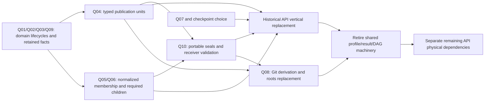

# Phase 2 workstream A: historical domain publication and interpretation retirement

Status: investigation of the implemented Schema 18 boundary and **Proposed / Pending Owner Decision** replacement options. Nothing in this document accepts a resource lifecycle, publication identity, current-winner rule, collection proof, Exchange policy or content deletion policy.

Investigated baseline: `20e0f8d78b77c6c8d37826fd6d639819631e166b`, the fetched main used for this independent worktree. The production composer is [schema.py:10](../../../src/repo_catalog/adapters/sqlite/schema.py#L10); its complete DDL fingerprint is `16110944d4b6a0942657644fe80383394210af1218a3e7111e331a1651fa211e`. The applicable decision order is the latest [AGENTS.md](../../../AGENTS.md), [transport-independent ADR TP-01–TP-08](../../transport-independent-core-adr.md), and [Phase 1 R1–R7 decision and scoped supersessions](../../phase1-api-original-retirement.md). The initial ADR's “not implemented” checkpoint does not override the later current-resource implementation described in [the implementation boundary](../../transport-independent-core-implementation.md).

## 1. The implemented identities are different things

The live historical path does not have one universal observation identifier. It has the following identities and lifetimes. This separation is necessary when deciding replacements.

| Concept | Schema 18 identity and producer | Actual responsibility and lifecycle |
| --- | --- | --- |
| Provider PR resource | `change_requests.change_request_id`; natural uniqueness `(repository_binding_id, change_request_kind, provider_change_request_number)`; `GitHubCollector.ensure_pr` | Typed repository/binding parent shared by observations, documents, current reviews, code and threads. The local string is portable; a provider number alone is not globally unique. |
| Provider PR document resource | `documents` primary key `(change_request_id, kind, provider_change_request_document_id)` | Shared natural identity. No parser result or body bytes belong to this identity. `pr-title` and `pr-body` use the canonical GitHub database resource ID. Ordinary current Issue retention does not choose this family's lifecycle. |
| Independent review thread resource | `review_threads(change_request_id, provider_resource_id)` | Shared typed parent for historical thread observations and current review-comment relationships. A thread ID is not a review ID or a comment ID. |
| One API acquisition occurrence | Portable `fetch_occurrence_uuidv4`, local `fetch_occurrence_id`; `ApiFacts.page` | One accepted response, repository owner, acquisition clock, exact decoded bytes, request/response metadata, page ordinal and continuation. Two equal byte bodies do not merge occurrences. Accepted partial GraphQL roots are occurrences too. |
| Source-wide acquisition input | `source_input_uuidv4`; `ApiFacts.source_input` | One accepted Source response/input with Source registration owner and original bytes. It cannot masquerade as a repository fetch. Manual Git discovery also uses this store for user-authored `legacy_normalized` configuration; that input is not an HTTP original. |
| Acquisition traversal | `fetch_collection_id` and `resume_scope_id`; `ApiFacts.begin/scope` | A scope-specific collection attempt/checkpoint, possibly comprising several occurrences and current-resource receipts. Operational endpoint/cursor scope is not a provider resource identity or an atomic domain publication. |
| Git byte acquisition | `git_acquisition_id`, exact `git_acquisition_publications` object/root sets | Verified cataloged raw Git bytes and repository ownership. This is domain content evidence, not an HTTP envelope. |
| One local interpretation execution | `parsed_result_uuidv4`; `ParserModel.create_result` | Repository **or** Source owner, profile definition, local parsing time, typed nonempty input set. There can be multiple results for one Git acquisition. A PR-list page can produce observations for several PRs and their documents in one result. |
| One individual domain observation | Observation UUIDs; Git fact UUIDs; composite page-item keys | Domain assertions distinct from shared identities. Direct `(parsed_result_uuidv4, owner)` FKs currently connect them to interpretation/publication eligibility. Their semantic history is not equivalent to parser execution history. |
| Atomic immutable output publication | One `parsed_result_publications` row per result | Seals the exact input set and exact output set. It prevents a selectively received result from being treated as the whole publication. It does **not** assert a collection is semantically complete. |
| Input membership | `(parsed_result_uuidv4, input_ordinal)` in `parsed_result_inputs` | Typed fetch/Git/Source input identity and composite owner validation. The normalized rows must exactly match the result's JSON manifest ordinal-by-ordinal. |
| Output membership | `parsed_fact_members` union + `fact_manifest_json` | Exact typed output identities across 19 domain table families. Immutable shared `documents` and `text_bodies`, and mutable current resources, are not parser outputs. |
| Parser admission authority | Profile, capability, verification, invalidation and local-trust UUIDs | Historical implementation gate. This is explicitly excluded from the accepted target architecture. Actual producer attribution and actual decoding semantics must survive its retirement. |
| Current profile selection | Profile-scope UUID + decision/predecessor/publication graph | Exactly one locally trusted, valid, fully published head. An unresolved PR-specific profile scope blocks repository fallback. No timestamp-based fallback applies. |
| Current fact selection | Fact-scope UUID + decision/predecessor/publication graph | Exactly one fully published, usable head whose result contains the target. Multiple heads, staged dependencies and conflicts yield no current selection. This target-resolution responsibility must survive DAG removal under a new owner-approved domain rule. |
| Semantic incomplete/unavailable/conflicting state | `inventory_observations.asserted_state`, `code_observations.state`, completion/Coverage records, staging/barrier rows, absent active selections | These meanings are not interchangeable. A fully sealed immutable output can assert `partial`. A valid individual observation can exist in a partial collection. A domain contradiction is not necessarily a missing dependency. |

Evidence: [ApiFacts:114–222](../../../src/repo_catalog/adapters/github/persistence.py#L114), [result/publication model:332–423](../../../src/repo_catalog/adapters/sqlite/parser_model.py#L332), [provider and observation tables:81–160](../../../src/repo_catalog/resources/catalog3.sql#L81), [typed inputs and publications:773–868](../../../src/repo_catalog/resources/catalog3.sql#L773), [selection views:987–1056](../../../src/repo_catalog/resources/catalog3.sql#L987), [fact selections:1215–1314](../../../src/repo_catalog/resources/catalog3.sql#L1215).

## 2. Confirmed reachable producer/store/consumer chains

The following chains were traced from application calls through writer transactions and reader predicates. Table-name searches alone were not used as liveness evidence.

### 2.1 PR pages, detail, title and body

`sync pr/all` and resumed jobs reach `CollectionService._sync`, `GitHubCollector.sync`, `collection`/`detail`, and `ensure_pr`. An accepted page transaction calls `ApiFacts.page`, admits `decoded_api` CAS bytes, creates a `fetch_occurrences` row, and advances the committed collection cursor. `ensure_pr` creates the natural typed PR parent if absent, writes the **whole** canonical provider object in `change_request_observations.payload`, and attaches the origin occurrence. `ApiFacts.result` creates one result for that occurrence; `ownership` reads the repository owner from the occurrence. `ensure_pr` separately creates exact `pr-title`/`pr-body` text observations under natural document identities.

`ApiFacts.publish` seals each pending result before selecting a profile and then a fact. A page with several PRs can therefore have many PR and document output members, each independently selected by target scope. The shared result is not equivalent to a single PR observation. A PR-list title/body observation's `document_observations.fetch_occurrence_id` is deliberately NULL because the page collection is repository-wide rather than owned by that PR; the same result still has the actual input membership. Removing nullable direct fetch columns alone does not remove the durable API dependency.

Ordinary PR queries join `current_change_request_observations`; historical document queries join `usable_parsed_results`; explicit history exposes result/profile UUIDs and observation timestamps. Search indexing also reads historical document bodies through `usable_parsed_results`. The profile removal therefore affects writer admission, current selection, ordinary readers, history, search, Exchange and CLI output together.

Anchors: [collector collection:671](../../../src/repo_catalog/adapters/github/collector.py#L671), [ensure_pr:941–1026](../../../src/repo_catalog/adapters/github/collector.py#L941), [page:358](../../../src/repo_catalog/adapters/github/persistence.py#L358), [document:613](../../../src/repo_catalog/adapters/github/persistence.py#L613), [ordinary PR projection:380](../../../src/repo_catalog/application/pr_queries.py#L380), [historical document rows:824](../../../src/repo_catalog/application/pr_queries.py#L824), [PR observations public output:1043](../../../src/repo_catalog/application/pr_queries.py#L1043), [search index source:40](../../../src/repo_catalog/adapters/sqlite/index.py#L40).

**Simple deletion failure:** the writer's input-manifest validation fails before result creation; direct result/owner FKs fail; removing those constraints would make unsealed or selectively received multirow outputs look admitted. Dropping profile joins would also silently change historical current selection and public history/diagnostic semantics. Minimum replacement decisions: Q01 lifecycle, Q04 publication, Q09 field contract, Q05 list proof, and the historical-current part of Q01.

### 2.2 PR conversation comments and timeline events

PR conversation comments use the historical `issue-comment` normalizer and `ApiFacts.document`, independently from ordinary current Issues/comments. They have exact text bodies, canonical provider document IDs, origin/result ownership, author/URL and provider-shaped metadata. They are members of typed document collections. Repository-wide incremental comments can also produce PR-owned historical document outputs while the input collection remains repository-owned. Reviews and review comments instead use the current-resource path and are not immutable parsed-result output members.

Timeline pages emit `change_request_events` with a UUID, typed PR/repository/result, optional provider event ID, origin occurrence UUID, ordinal, opaque provider payload and observation time. `choose_page` selects timeline results by **occurrence** scope, so several page result selections coexist. `current_change_request_events` combines selected eligible pages, rather than choosing a single PR-wide latest event row. Event identity cannot simply become `(PR, provider_event_id)` because accepted event rows may lack a provider event ID and have ordering/collection responsibilities.

Anchors: [document dispatch:2336](../../../src/repo_catalog/adapters/github/collector.py#L2336), [timeline writer:2375](../../../src/repo_catalog/adapters/github/collector.py#L2375), [page-scoped selection:144](../../../src/repo_catalog/adapters/github/persistence.py#L144), [current event view:1364](../../../src/repo_catalog/resources/catalog3.sql#L1364), [timeline query:1057](../../../src/repo_catalog/application/pr_queries.py#L1057).

**Simple deletion failure:** exact comment content/provenance/history is lost; document membership and event origin guards fail; page-selection loss changes event roster semantics. Minimum replacements: Q02 comments, Q04 publication, Q05 collections, Q09 event/document fields. A domain event occurrence key and duplicate policy are implementation-dependent until the accepted event field/lifecycle contract establishes the available provider identity.

### 2.3 Independent threads, nested children and current reviews

`threads` accepts a GraphQL root, including a structurally valid partial root with errors, and creates a historical result. `_thread` writes `review_thread_observations` keyed by `(result, PR, provider thread ID)` after ensuring the shared thread identity. Its payload has normalized thread attributes and a comment-boundary structure including IDs/page information/completeness. Current review-comment admissions and their normalized page receipts are separate mutable outputs; they must not be sealed as immutable interpretation members.

Historical current thread readers use `current_review_thread_observations`. Child-boundary query checks identify eligible thread observations belonging to a selected root by joining **result inputs → fetch occurrences → root collection** and consider all observations at the latest observation instant. Thus removing a result's mandatory input can leave an apparently valid thread row whose child-membership/coverage boundary can no longer be checked. The acquisition workstream additionally confirms that restart and code merge-role expectations read the accepted root bytes, including partial roots.

Anchors: [thread writer:1829](../../../src/repo_catalog/adapters/github/collector.py#L1829), [thread fact table:1201](../../../src/repo_catalog/resources/catalog3.sql#L1201), [current thread view:1328](../../../src/repo_catalog/resources/catalog3.sql#L1328), [child-boundary query:632](../../../src/repo_catalog/application/pr_queries.py#L632), [thread current output:1114](../../../src/repo_catalog/application/pr_queries.py#L1114).

**Simple deletion failure:** restart cannot reconstruct actual accepted child cursors; query coverage cannot prove the selected root/child relationship; a partial root might incorrectly make an entire thread tree eligible/complete. Minimum replacements: Q02 thread lifecycle, Q04 publication, Q05/Q06 nested evidence/restart, Q09 normalized thread/merge fields. Current review-resource lifetime and receiver-local check rules remain independently accepted.

### 2.4 Code listings and code observations

PR commit/file listing pages each create ordinary per-occurrence results. `code_commits` and `code_file_changes` use a primary key containing local `fetch_occurrence_id`, position and result. Listing guards require the page to belong to the exact listing collection/kind and use the declared object format. Their current views explicitly join the origin occurrence to an active **page** fact selection. The ordinary public output orders by fetch-page ordinal then item position.

After listings, review/thread roots and Git targets have been attempted, code assembly creates a **different result** with a union of all current-job API occurrences, cached listing occurrences, the original selected PR occurrence, and Git acquisitions supplying required roles. It emits one `code_observations` row tied to the exact PR observation, listing identities, head/base OIDs, state and detailed expected roles. `code_acquisitions` maps each required role to actual typed published Git roots. Its state can be `partial` despite a sealed result. The observation/result is not the permanent identity of a listing, target or Git object.

Anchors: [listing setup:691](../../../src/repo_catalog/adapters/github/collector.py#L691), [listing writers:2431–2469](../../../src/repo_catalog/adapters/github/collector.py#L2431), [composed code result:2716–2759](../../../src/repo_catalog/adapters/github/collector.py#L2716), [code observation:2760](../../../src/repo_catalog/adapters/github/collector.py#L2760), [item context triggers:618–623](../../../src/repo_catalog/resources/catalog3.sql#L618), [current item views:1365](../../../src/repo_catalog/resources/catalog3.sql#L1365), [role diagnostics:531](../../../src/repo_catalog/application/pr_queries.py#L531), [item output ordering:1022](../../../src/repo_catalog/application/pr_queries.py#L1022).

**Simple deletion failure:** list-entry identity/order and ownership fail; changed head/base cannot be detected against the original PR state; a complete code observation could lose expected merge/review targets or admit the wrong Git acquisition. Minimum replacements: Q04 publication, Q05 listing proof, Q06 durable nested/target evidence, Q08 Git interpretation selection, Q09 fields. Proposed page-independent item identity is `(listing_observation_uuidv4, ordinal)` plus typed object/path attributes and a checked normalized member set; natural `(listing, path)` uniqueness is only appropriate if the admitted provider contract rules out duplicates.

### 2.5 Source inventory and observed repository names

`source discover`/planned discovery reaches `CollectionService._discover` and `GitHubCollector.inventory`. Each accepted `/user`, supported owner or repository page calls `source_input`. The collector validates endpoint scope and selected/listed repository identity **before** saving the input; rejected later pages retain no original. Already committed accepted prefixes can survive a later failure.

`inventory_result` creates one **Source-owned** result from all accepted input UUIDs. In a single output transaction the application registers/binds repository identities, links Source membership, adds endpoints, records name observations, creates one `repository_inventory_observations` per member repository, creates one `inventory_observations` assertion, seals the result, selects the Source profile and selects its inventory fact. `asserted_state='partial'` is allowed and selected. Member inventory rows have no individual observation clock column; their root `inventory_observations` and original inputs carry the observation evidence. Name rows have their own clock/provenance and optional result: explicit local naming has no parser dependency.

`repository_inventory_observations` is owned by the Source, although it describes a repository. Its Source/repository membership trigger is independent of its result-owner FK. `repository_name_observations` supports either repository-owned or Source-owned interpreted names, plus local noninterpreted names; the Source-owned branch also requires Source/repository membership. `repository_observed_names` admits usable names through selected inventory/repository-name profiles, while `current_repository_inventory_observations` joins the selected Source inventory. Ordinary repo queries expose selected inventory metadata and explicit unresolved-selection reasons.

Anchors: [accepted input helper:469](../../../src/repo_catalog/adapters/github/collector.py#L469), [inventory result:658](../../../src/repo_catalog/adapters/github/collector.py#L658), [discovery output transaction:194–322](../../../src/repo_catalog/application/collection_service.py#L194), [inventory publication:394](../../../src/repo_catalog/application/collection_service.py#L394), [name ownership/view:33–60](../../../src/repo_catalog/resources/identity_relations.sql#L33), [inventory ownership/view:103–130](../../../src/repo_catalog/resources/identity_relations.sql#L103), [ordinary repo diagnostic:292](../../../src/repo_catalog/application/query_service.py#L292), [inventory output:829](../../../src/repo_catalog/application/query_service.py#L829).

**Simple deletion failure:** discovery loses accepted prefix evidence and Source scope/completeness; result eligibility and provider-derived name resolution fail; collapsing owner to repository merges independent Source assertions. Minimum replacements: Q03 inventory observation/publication identity and lifecycle, Q04 publication, Q05 Source member/terminal proof, Q09 provider fields, and Q10 any portable reduced Source-derived assertion. Permanent Source registration identity itself is already accepted and is not a new decision. Current one-repository Exchange deliberately excludes Source-wide inventory.

### 2.6 Git acquisition, interpretation, snapshots and search

Git importer acquisition publishes the exact raw object/root set before interpretation. `GitParsing` checks the acquired-byte membership is published, verifies raw object identity/format/type/size and quarantine for every object, and writes result-owned immutable commit/tree/tag/text/manifests. Each structural fact is tied to the repository object membership of its acquisition. Bounded acquisition writes may commit unsealed prefixes, which remain unavailable through eligible/current views until publication; resume retains the original fact UUIDs. Explicit Git `reparse` remains supported and creates another result over the same exact acquisition, never another remote observation.

Git decoders are configured by profile settings (`git_text_encoding`, `git_metadata_encoding`, error mode and text limit). These settings have actual meaning: the same verified bytes may yield UTF-8 versus Latin-1 text, classification and metadata. Search code/commit readers recover encoding settings from profiles to calculate raw-byte match offsets. Retiring profiles must preserve the actual decoding evidence/offset semantics without preserving whole-definition authority. Raw object structural facts and decoded text interpretations have different identity needs.

Ordinary Git reads use the selected repository result; explicit snapshot reads use that snapshot's eligible result. Explicit PR-only Git object reads have no regular-ref snapshot and use `selected_git_acquisition_results` to find at most one interpretation; two interpretations produce `selection_unresolved`. Neither maximum generation nor latest parser version is a safe replacement. Ref names and paths remain exact raw bytes; Git object identity remains `(object_format, oid)` with SHA-1/SHA-256 verification.

Anchors: [Git acquisition seal:377](../../../src/repo_catalog/adapters/git/parsing.py#L377), [decoder settings:24–58](../../../src/repo_catalog/adapters/git/parsing.py#L24), [staged write/resume:62–134](../../../src/repo_catalog/adapters/git/parsing.py#L62), [byte verification:149–190](../../../src/repo_catalog/adapters/git/parsing.py#L149), [reparse:420](../../../src/repo_catalog/adapters/git/parsing.py#L420), [Git fact typed FKs:305–344](../../../src/repo_catalog/resources/catalog3.sql#L305), [Git current/eligible views:36](../../../src/repo_catalog/resources/git_facts.sql#L36), [explicit-object resolver:4](../../../src/repo_catalog/application/git_query_context.py#L4), [default Git context:241](../../../src/repo_catalog/application/query_service.py#L241), [search offsets:1181](../../../src/repo_catalog/application/query_service.py#L1181), [text offsets:1244](../../../src/repo_catalog/application/query_service.py#L1244).

**Simple deletion failure:** incomplete prefixes become eligible, different decodes are collapsed or arbitrarily chosen, explicit PR targets become unreadable, and search byte offsets change. Minimum replacement: Q08 Git interpretation/snapshot/current resolution, Q04 publication and Q09 Git-decoding facts. Verified raw Git storage, integrity/quarantine and CAS-41 are already authorized final content responsibilities and must remain.

## 3. Executed DDL obligations, including generated JSON references

The characterization probe executes the complete production composition, then uses `PRAGMA foreign_key_list` and the installed `parsed_fact_members` view to identify the following exact output families. The full machine-checkable FK rows are emitted in its receipt; the repository-wide audit covers other keys, generated columns, indexes, views and triggers.

| Result-owned output family | Significant current identity, owner and extra API dependency | Classification for the target |
| --- | --- | --- |
| `change_request_observations` | Portable observation UUID; unique `(result, PR)`; composite PR/repository and result/repository FKs; origin fetch FK and result-input guard | Replace storage/publication/selection after Q01/Q04/Q09; retain actual PR facts. |
| `document_observations` | Portable observation UUID; unique `(result, natural document key)`; exact text hash; composite natural-document, PR/repository and result/repository FKs; optional fetch and input guard | Replace publication/attribution after Q01/Q02/Q04/Q09; retain exact content/natural identity. |
| `change_request_events` | Observation UUID; typed PR/result/repository; optional provider event ID and origin fetch UUID | Replace event/collection identity after Q04/Q05/Q09; do not drop actual events. |
| `review_thread_observations` | Thread-observation UUID; unique `(result, PR, thread ID)`; typed thread and repository; root relationship inferred through result input | Replace after Q02/Q04/Q06/Q09. |
| `code_observations` | Observation UUID; typed PR observation, exact listing links/head/base and result/repository | Replace after Q04/Q05/Q06/Q08/Q09; retain race/required-target evidence. |
| `code_commits`, `code_file_changes` | `(listing_id, local fetch_id, position, result)`; typed result/repository and fetch/repository; listing/page/kind guards | Replace input-dependent identities after Q04/Q05/Q09. |
| `inventory_observations` | One assertion per result; `(result, Source registration)` FK; local Source + portable Source registration composite FK | Replace after Q03/Q04/Q05/Q09; retain Source-owned scope/time/uncertainty. |
| `repository_inventory_observations` | Observation UUID; unique `(result, repository)`; Source result FK and Source/repository membership guard | Replace after Q03/Q04/Q09; retain independent Source member assertions. |
| `repository_name_observations` | Name-observation UUID; optional interpreted result; XOR typed repository/Source interpretation owner; Source membership guard | Retain final name evidence; replace interpreted publication gate. Local names remain independent. |
| `snapshots`, `ref_observations` | Snapshot identity + raw ref name; typed acquisition/repository/result FKs | Retain domain ref observations/snapshot evidence; reshape derived interpretation association after Q08/Q04. |
| `commits`, `commit_parents`, `tree_entries`, `tag_objects`, `root_manifests`, `root_manifest_entries`, `git_text_facts` | Fact UUID; result/acquisition/repository membership FKs; unique typed structural keys; raw-content validation | Retain domain content and structure; replace result/profile eligibility after Q08/Q04/Q09. |

Non-output tables with direct result FKs include `parsed_result_inputs`, `parsed_result_publications`, `fact_selection_decisions` and `exchange_blocked_results`. They are mechanisms rather than domain facts. The corresponding table families must not be mistaken for the 19 output families.

Historical observations additionally use **generated capability columns** and composite capability FKs installed later in `catalog3.sql`/`git_facts.sql`. Input/publication immutability, `*_no_replace`, `*_result_sealed`, `*_origin_in_result`, membership and owner guards protect direct SQL, not only Python writers. The live publication guards require exact input-manifest rows/counts and exact output set identity, including duplicate rejection. Empty output sets are valid sealed interpretations; nonempty typed inputs are required in Schema 18. These two conditions serve different purposes.

`json_contracts.py` registers `parsed_results.input_manifest_json` and `parsed_result_publications.fact_manifest_json`, typed references and reference lists, embedded owners and local-reference exclusions. Generated `json_contracts.sql` guards validate every declared reference and owning relationship. `derivation_json`, `completion_markers.evidence`, Coverage `details`, name provenance, inventory scope and code details can include registered result/fetch/collection/Git references beyond physical FKs. Removing a column/table while leaving a reference registry, generated SQL or public JSON schema behind is incomplete retirement.

Anchors: [manifest/input equality:1168–1178](../../../src/repo_catalog/resources/catalog3.sql#L1168), [exact output union/guard:1368–1392](../../../src/repo_catalog/resources/catalog3.sql#L1368), [origin guards:1429–1446](../../../src/repo_catalog/resources/catalog3.sql#L1429), [Git input membership/sealing:30–35](../../../src/repo_catalog/resources/git_facts.sql#L30), [JSON registrations:89](../../../src/repo_catalog/adapters/sqlite/json_contracts.py#L89), [typed reference vocabulary:110](../../../src/repo_catalog/adapters/sqlite/json_contracts.py#L110), [owner validators:1510](../../../src/repo_catalog/adapters/sqlite/json_contracts.py#L1510).

### Transitional machinery mapping

| Current object family | Target mapping and removal condition |
| --- | --- |
| `parser_profiles`, `parser_profile_capabilities`, `parser_profile_verifications`, `parser_profile_verification_invalidations`, `local_parser_profile_verification_trust` | Remove after all historical writers/readers use actual module/version, typed domain validity and necessary decode attributes. Whole-parser certificates and receiver-local profile trust are excluded from the accepted target, not recreated as publication authority. |
| `parsed_results`, `parsed_result_inputs`, `parsed_result_publications` | Replace after Q04. Preserve typed owner, atomic output membership, incomplete-output isolation, late-dependency handling and real Git/domain dependencies. Do not preserve API-message inputs. |
| Five `parser_profile_selection_*` tables | Remove with profile gates. Current views, CLI operations, staging, generated refs and Exchange closure change in the same stride. Their runtime conflict barriers are not a substitute for a domain-current rule. |
| Five `fact_selection_*` tables | Remove after Q01/Q02/Q03/Q08 establish applicable historical/current domain behavior. Replace conflict/unavailable semantics, not the DAG mechanism. |
| `fetch_occurrences`, `source_input_observations` | Remove API-original cases after publication, collection/restart/304 dependencies migrate. User-authored Source configuration evidence is separately legitimate, and raw Git acquisitions survive independently. |
| `fetch_collections`, `collection_memberships`, `code_listings`, completion evidence | Replace only after Q05/Q06; preserve normalized collection/listing identity, members, terminal and child proof. Operational cursor/request scopes must not define permanent domain ownership. |
| `exchange_blocked_results`, `exchange_selection_blocks` | Replace under Q10 with bounded domain-observation/publication conflict barriers. Preserve same-portable-key contradictions and affected dependency closure. |
| `stored_bytes`, Git `payloads`, Git mappings, `text_bodies`, content maps, quarantine | Retain final domain text/raw Git physical integrity. Separate API-only dependencies after migration, without retention durations, automatic deletion or weakening CAS-41. |
| Mutable current Issue/review resources and current receipt tables | Retain their accepted current-state/mixed-field attribution behavior. Do not attach them to immutable parser output seals. |

This is a dependency-conditional classification, not an unconditional `DROP` list.

## 4. Minimum domain publication semantics

The accepted target removes saved API inputs and parser authority. It does **not** remove these minimum independent responsibilities:

1. Each retained assertion has a typed domain subject and real repository or Source owner. Cross-owner references fail in SQL and on Exchange intake.
2. A writer can stage an incomplete multirow domain unit without ordinary readers considering it whole. A complete admitted unit has exact typed output membership, and an admitted partial unit honestly retains its partial meaning.
3. Publication time, remote observation time, provider update/revision evidence and operational checkpoint time remain distinct. A multi-input code publication does not retimestamp a PR seen at 100 as observed at seal time 400.
4. The actual producer module/version is retained per assertion/group; merging differently sourced current fields retains field attribution. Module/version and local receipt/parse/publication times do not rank domain evidence.
5. A portable unit identifies normalized required dependencies and exact output membership. Receiving one of three required members may stage valid individual data, but cannot admit the full seal or completeness claim. Immutable key/content conflicts block affected eligibility regardless of arrival order.
6. Actual domain content remains exact: UTF-8 text hash/bytes, verified Git object bytes/OIDs and byte-sensitive ref/path/header/message values. A body hash identifies content, not an observation or publication.
7. Current-resource collection receipts attest already admitted values without retaining all historical mutable row bodies. A receipt is not a current resource version and cannot import sender-local `last_checked_at_us`.
8. Semantic completeness is independently checked against required normalized set/terminal/child/target evidence. Being sealed, input-valid or parser-valid never proves completeness.

### Candidate structures: Proposed / Pending Owner Decision

The recommended candidate has separate typed `repository_publications` and `source_publications`, plus immutable domain observations with direct composite publication-owner FKs. It has no API input manifest and no parser profile reference. A portable seal can carry an exact **typed normalized member descriptor**, count and digest; local SQL verifies the declared set equals admitted typed membership. The precise descriptor/digest format is pending Q04/Q10. Member tables can be family-specific, or membership can be defined by direct observation FKs and a generated typed union; both preserve SQL referential integrity. A generic `(table_name, opaque_key_json)` database table alone is insufficient because SQLite cannot enforce its typed subject FKs.

Examples of minimal candidate entities (significant columns, not final DDL):

| Candidate entity | Key and significant attributes | Status / decision |
| --- | --- | --- |
| `repository_publications` | Portable UUID, repository UUID, actual producer module/version, local `published_at_us`; header is immutable, seal distinct from staging | Proposed Q04. A heterogeneous writer needs per-member producer attribution. |
| `source_publications` | Portable UUID, Source registration UUID, producer and publication time | Proposed Q03/Q04; never repo-owned merely because a member refers to a repository. |
| PR/document/thread observations | Portable observation UUID where independent evidence needs one; natural typed subject; publication/repository composite FK; own observed clock/scope/presence evidence; normalized fields and exact text links | Proposed Q01/Q02/Q04/Q09. Preserve natural document identity and do not create a document surrogate/version entity. |
| `repository_collection_observations`, `source_collection_observations` | Domain enumeration UUID, typed scope/owner, observation instant and normalized member/terminal/required-child evidence | Proposed Q05/Q06. Enumeration identity remains distinct from publication. |
| Source inventory assertions/members | Source enumeration and Source publication links; repository member FK and independent provider metadata/asserted name | Proposed Q03/Q04/Q05/Q09. Do not rewrite local repository metadata from independent Source facts. |
| Code listing observations/entries | Listing observation UUID, exact PR observation/head/base context, typed collection evidence; `(listing observation, ordinal)` entry key | Proposed Q04/Q05/Q09. No HTTP fetch row is a permanent item key. |
| Code target observations | PR observation, role, missing/null/OID state, object format/OID, captured observed scope/time, required publication/acquisition | Proposed Q06/Q08/Q09. Omitted targets are not explicit absent targets. |
| Git structure and decoded facts | Verified object identity; typed repository-acquisition ownership; actual parser/decode attributes where values differ; exact raw bytes | Accepted content retention; structure layout implementation-dependent; interpretation resolution Proposed Q08. |
| Current/conflict projections | Candidate-set predicates using approved comparable provider clocks or explicit domain reference; unresolved candidates remain visible | Proposed Q01/Q02/Q03/Q08. No parser or receipt-order ranking. |

Illustrative publication DDL below is **nonproduction**, proposed under Q04. Existing typed parent tables are assumed. Module/version on the header applies only if every member has the same producer; otherwise it belongs on members. `member_count` is not collection completeness. The full integrated disposable schema supplies candidate collection and field contracts separately.

```sql
-- Proposed / Pending Owner Decision P2-Q04.
CREATE TABLE repository_publications (
    publication_uuidv4 TEXT PRIMARY KEY,
    repository_uuidv4 TEXT NOT NULL REFERENCES repositories(repository_uuidv4),
    parser_module TEXT NOT NULL CHECK(length(parser_module)>0),
    parser_version TEXT NOT NULL CHECK(length(parser_version)>0),
    UNIQUE(publication_uuidv4, repository_uuidv4)
) STRICT;

-- Proposed / Pending Owner Decision P2-Q03/Q04.
CREATE TABLE source_publications (
    publication_uuidv4 TEXT PRIMARY KEY,
    source_registration_uuidv4 TEXT NOT NULL
        REFERENCES sources(source_registration_uuidv4),
    parser_module TEXT NOT NULL CHECK(length(parser_module)>0),
    parser_version TEXT NOT NULL CHECK(length(parser_version)>0),
    UNIQUE(publication_uuidv4, source_registration_uuidv4)
) STRICT;

-- Proposed / Pending Owner Decision P2-Q04/Q10.
-- Exact canonical encoding and SQL membership verifier are unresolved.
CREATE TABLE repository_publication_seals (
    publication_uuidv4 TEXT PRIMARY KEY,
    repository_uuidv4 TEXT NOT NULL,
    member_count INTEGER NOT NULL CHECK(member_count>=0),
    member_set_sha256 BLOB NOT NULL CHECK(length(member_set_sha256)=32),
    published_at_us INTEGER,
    FOREIGN KEY(publication_uuidv4, repository_uuidv4)
        REFERENCES repository_publications(publication_uuidv4, repository_uuidv4)
) STRICT;

-- Alternative design for immutable document observations only.
-- Natural document identity is unchanged; no document surrogate/version entity.
-- Field presence/provider-clock columns require P2-Q09 and P2-Q02 decisions.
CREATE TABLE proposed_document_observations (
    observation_uuidv4 TEXT PRIMARY KEY,
    publication_uuidv4 TEXT NOT NULL,
    repository_uuidv4 TEXT NOT NULL,
    change_request_id TEXT NOT NULL,
    kind TEXT NOT NULL,
    provider_change_request_document_id TEXT NOT NULL,
    text_body_sha256 BLOB REFERENCES text_bodies(sha256),
    observed_at_us INTEGER,
    UNIQUE(publication_uuidv4, change_request_id, kind,
           provider_change_request_document_id),
    FOREIGN KEY(publication_uuidv4, repository_uuidv4)
        REFERENCES repository_publications(publication_uuidv4, repository_uuidv4),
    FOREIGN KEY(change_request_id, repository_uuidv4)
        REFERENCES change_requests(change_request_id, repository_uuidv4),
    FOREIGN KEY(change_request_id, kind, provider_change_request_document_id)
        REFERENCES documents(change_request_id, kind,
                             provider_change_request_document_id)
) STRICT;
```

Implementation-dependent guards would enforce UUIDv4/nonempty NUL-free producer strings, no replacement of portable immutable keys, no post-seal insertion/update/deletion, exact typed member-set equality and Source-member ownership. Typed indexes should start with `(publication_uuidv4, owner)` and subject/clock indexes should match ordinary current/historical predicates. Seals reference **domain evidence**, never an HTTP payload/hash/request.

### Transactions and reader predicates

For a single accepted resource fragment, the proposed transaction validates normalized scope/field presence, interns legitimate text/Git content, creates required shared typed identities, writes observations and checked fragment membership, then seals the intended domain unit. No checkpoint is advanced before the entire admitted fragment transaction commits. Cancellation after commit reuses durable normalized prefix evidence; cancellation before commit exposes no partial membership from that transaction.

For a multirow code or thread result, the publication is either staged until every required normalized dependency is present, or sealed as an explicitly partial domain assertion. Which granularity is appropriate is Q04/Q06, not an implementation convenience. A fragment's valid members can survive an incomplete parent tree; they cannot provide the parent's terminal/child-complete evidence. Job attempts and credentials remain operational fences rather than permanent domain object owners.

Reader candidate predicate: typed owner/subject valid, publication/fragment membership admitted as required by that family, domain bytes available and uncorrupted, no same-key immutable conflict, and relevant required dependency validity established. Current predicate then applies **only** the owner-approved family ordering/resolution rule; semantic complete predicate separately evaluates collection/child/target evidence. Historical readers may expose valid partial observations with explicit state. A newer partial Coverage candidate continues to defeat older complete Coverage under the already accepted maximum-observation-time candidate-set rule.

Deletion dependency order: first replace writers/publication refs and exact normalized membership, then readers/query planning/search and generated JSON contracts, then Exchange admission/promotion/closure/barriers, then remove profile/fact-selection CLI/schema and API original stores after restart/304 and completeness users have moved. A fresh incompatible schema is allowed; dual writes and compatibility facades are unnecessary. Actual retained catalogs are not mutated by this task, and no retention duration or GC follows from structural removal.

## 5. Concrete unresolved decision register

These questions preserve existing accepted invariants. Each recommendation is a proposal, not an accepted decision. The integrated register may refine labels according to dependencies.

### P2-Q01: PR attribute/title/body lifecycle and ordinary current selection

**Question:** For one typed PR, retain every admitted normalized domain observation (including title/body evidence), or retain only current candidates plus unresolved conflicting candidates? Under either lifecycle, what comparable provider clock/scopes determine the ordinary current candidate set?

Accepted constraints: permanent typed identity; exact text; truthful per-value provenance; missing/null/empty distinction; no parser/receipt/parse-time ordering; incomparable/equal-clock contradictions cannot yield an undisputed winner. The existing DAG is a temporary behavior, not the answer.

Alternatives:

- **History plus current projection:** retain normalized observations and derive current candidates using the approved provider clock partial order. Explicit history is an observation query. Noncomparable contradictory candidates remain unresolved.
- **Current candidates plus durable capture/conflicts:** retain only the latest approved candidate set and its field evidence, with any immutable collection/publication receipts required for completeness. An earlier body's full text/history need not be a current-resource requirement. Retention/deletion policies are separate; a fresh schema layout may implement current state without introducing automatic GC.

**Recommendation:** retain normalized PR observation history initially because current public PR history, code-observation anchors and race diagnostics already require specific historical PR states. Use provider evidence to derive candidates; require explicit ambiguity when clocks are absent/incomparable. This avoids inventing a winner while decoupling APIs, and the owner can separately decide a narrower product history. It is not a recommendation to retain every provider response key.

Concrete difference: PR `R/B/41` has observation A with provider `updated_at=100`, title “A”, head `h1`; B has `updated_at=200`, title “B”, head `h2`. An old code listing acquired for A still points to `h1` after B arrives. History exposes A/B and the A-target match; current-only needs a normalized code anchor containing A's required exact target/scope facts. If B omits body, A's body evidence is inherited only under the approved field rule; if B explicitly sends null, it is a new null value, not omission. Observation C from an incomparable endpoint with title “C” cannot be ordered by parsed-at/version/UUID.

Integrity: history preserves auditability; current-only requires explicit retained code/publication anchors. Neither choice permits fallback to an older complete collection or treating absent field evidence as explicit null. Storage: history grows with admitted observations and unique bodies, whereas current-only grows with resources/conflicts/receipts and retained anchors. Runtime: subject+provider-clock indexes avoid full history scans; current-only needs atomic candidate replacement/merge and receipt independence. Exchange: history sends bounded selected observation closure; current-only sends field candidates and preserved anchors. Backup retains required content under either. Coverage is unchanged. Tests: old history assertions remain meaningful only for a retained-history choice; ordering/omitted/null/incomparable/changed-head tests are required in both.

Dependencies: Q04/Q09 define facts/provenance and Q05 supplies membership. **Blocks:** PR production replacement and ordinary historical-current semantics; it does not block audits or current accepted-contract fixes.

### P2-Q02: PR conversation comments and independent thread histories

**Question:** Retain full observation history for PR conversation comment text and thread state, current candidates for both, or history for comment text with current thread-state candidates? Which fields use which provider clocks?

Accepted constraints: natural document identity, exact required text, current review resources remain current, typed thread/review/comment parents, independent thread identity, no arbitrary conflict ordering. Ordinary Issue retention is not an accepted PR conversation-comment rule.

Alternatives: (A) both histories, with current candidate projections; (B) both current candidate sets with durable membership/capture receipts; (C) comment text history and current thread-state candidates. All can preserve exact current content and honest child collections without retaining roots. None can seal mutable current review bodies as historical parser outputs.

**Recommendation:** A for PR conversation comments and independent thread assertions until product history requirements are narrowed. Keep current reviews/comments on their accepted current contract. Thread state, comment membership, and current review-comment state remain separate relations, even when captured in one GraphQL fragment.

Concrete difference: comment `D=(PR41,issue-comment,7)` says “first” at update clock 100 and “edited” at 200; thread T is unresolved at observation 100 and resolved at 200; the 200 tree is partial after one child page. A exposes both texts and both thread states but cannot claim complete child membership at 200. B exposes latest/conflicting values and retains the 100/200 admitted-member receipts without retaining old body “first.” C can show the edit history while retaining only current resolution candidates. “resolved” does not imply all child comments were enumerated.

Integrity/runtime: combining lifecycle or clock scopes makes a thread change falsely retimestamp a comment. History costs observation/body storage; current candidates reduce repeated bodies but require exact immutable member receipts and field attribution. Exchange and backup obey the selected content lifecycle; normalized nested proof remains separately required. Coverage cannot infer child completeness from a current thread state. Tests must cover edit clocks, no comparable clock, partial newer root, independent thread resolution, exact text and current-review admission without historical dependencies.

Dependencies: Q04/Q05/Q06/Q09. **Blocks:** replacing historical conversation/thread stores; not accepted current review behavior.

### P2-Q03: Source inventory enumeration, publication and member lifecycle

**Question:** Is one Source inventory observation a normalized enumeration identity with a separate atomic publication identity, or does one inventory observation UUID identify both? Retain all admitted inventory/member observations or current candidates with durable enumeration receipts?

Accepted constraints: independent Source/service/repository identities; typed Source ownership; repository-binding identity lookup, never name/URL merging; truthful scope/time/completeness; partial enumeration cannot claim complete; independent Source facts do not rewrite repository registration metadata.

Alternatives: (A) separate Source enumeration and publication identities so a committed normalized prefix can exist before the output seal; (B) one Source inventory observation UUID with explicitly staged/sealed states, normalized members and terminal proof. Either may retain history or current candidates; this lifecycle choice must be explicit rather than hidden in the identifier.

**Recommendation:** A, with history of normalized inventory observations/members initially. Separate enumeration evidence from Source fact publication because accepted inputs can precede registration/output publication and partial inventory is legitimate. A canonical provider repository identity maps to an existing binding when valid; the new observation belongs to its Source regardless of repository references.

Concrete difference: Source S1 enumerates repository R1 at 100, then fails before terminal. Source S2 fully enumerates R1/R2 at 200. A assigns enumeration E1/publication P1 to the partial S1 result and E2/P2 to S2. B uses I1/I2 with explicit state transitions. R1 can carry S1 name “owner/old” and S2 name “owner/new” without merging S1/S2 or rewriting local `repositories.name`. A missing S1→R1 membership rejects S1's member assertion even if the publication's Source FK exists. A newer partial S1 enumeration cannot inherit S1's older complete inventory Coverage.

Storage/performance: a separate header adds O(enumerations) rows; normalized per-member indexing `(enumeration, repository)` replaces original pages. Source current queries use `(Source, observation clock)` candidate indexes and cannot scan every repository's history. Exchange: Source-wide inventory remains outside one-repository format unless Q10 explicitly chooses a reduced portable assertion; publication metadata must not pull an entire Source inventory through a name row. Backup retains required domain facts/receipts without original bytes. Tests must cover empty Source inventory, prefix interruption, unsupported owner, wrong Source membership, independent Source metadata, equal-time contradicting complete/partial assertions and selective repository Exchange.

Dependencies: Q04/Q05/Q09 and Q10 reduced assertions if requested. **Blocks:** Source historical API-original removal. Permanent Source registration UUID identity is not being reopened.

### P2-Q04: Minimum atomic domain-publication identity and membership

**Question:** Should atomic publication be per individual resource observation, or an independent portable UUID for a coherent domain unit whose exact typed outputs can span several observations/collections? What granularity is portable and eligible?

Accepted constraints: typed owner/parents, immutable identity conflict detection, no incomplete-output admission, actual module/version only, no saved HTTP originals or parser authority, no fabricated remote clock and no sealing mutable current rows.

Alternatives:

- **Per-resource observation:** each PR/document/thread row is admitted atomically; collection/code assemblies carry their own typed descriptors. A large provider page may create many independent units. Required multirow structures use their natural root and explicit typed children/seal.
- **Separate domain publication UUID:** one repository or Source owned unit has typed members and an immutable exact output seal. Units are chosen by domain consistency boundaries, independent of response/page/parser execution; e.g. one immutable thread fragment or one PR-code assertion and its required normalized relationships.

**Recommendation:** separate typed repository/Source publications, with direct family FKs/generated typed membership and exact seals. Publication membership should include only the actual domain outputs whose atomic availability matters. Do not replicate legacy “all current-job fetches are inputs” or choose a whole-repository output batch merely because the writer already has those rows.

Concrete difference: one PR-list fragment contains PR41 and PR42 plus their title/body observations. Resource units let PR41 transfer independently if its own prerequisites are satisfied; a shared unit requires all six immutable outputs before sealing. A code assertion C uses PR41 observation A, two completed listings and three Git target acquisitions. C's legitimate dependencies are those normalized facts, not every API message made by the job. Selective Exchange receiving only C's header and one listing must not make C complete; repeated/reordered complete members admit idempotently.

Integrity: batch granularity defines which missing/conflicting child disables a unit, so it is owner-level architecture. Coarse batches can block unrelated valid resources and enlarge selective closure; fine batches have more headers/seals and explicit cross-unit links. Indexed per-unit checks are O(actual members) and reverse dependency queues O(actual edges). A generic untyped JSON manifest is insufficient local integrity. Exchange seals exact normalized members, stages missing dependencies and blocks same-key conflicts; no global repository scans. Coverage/collection completeness remains independent. Backup copies only required domain bytes and physical quarantine evidence; no API seal inputs.

Tests: wrong owner, missing/extra/duplicate member, post-seal insertion, empty unit, partial explicit state, current mutable receipt separation, conflicting portable publication UUID, independent source unit, delayed dependencies and reordered/repeated records. This is the main architectural prerequisite for removing `parsed_results` and its API inputs, but Q01/Q02/Q03/Q08 still decide each family's semantics.

Dependencies: Q09 field grouping, Q05/Q06 proof dependencies, Q10 portable seal representation. **Blocks:** production publication replacement; audits/probes remain authorized.

### P2-Q08: Git interpretation, ref-snapshot and current selection after DAG retirement

**Question:** With verified raw bytes retained, make structural Git facts canonical by object identity and decoded facts explicit by decoding contract, or retain independent derivation observations with domain-specific unresolved candidate selection? How are ordinary refs/current repository roots and explicit PR-only targets selected without parser/fact DAGs?

Accepted constraints: verified SHA-1/SHA-256 bytes/OIDs; exact raw headers/messages/ref names/paths; real repository-acquisition ownership; no parser-version/receipt/parse-time winner; explicit PR target readable without regular ref snapshot; raw-byte reanalysis is domain work, API replay remains retired.

Alternatives: (A) canonical object-derived structure plus distinct attributed decode records; ref/acquisition observations supply historical/current roots using approved domain evidence, and explicitly selected decoding behavior is a domain contract; (B) independent normalized derivation observations over exact acquisitions, with candidate-set ambiguity for differing decoded values and explicit diagnostic access, but no whole-parser/profile authority or selection DAG. Neither option requires API originals. Retaining a new parser-profile selection DAG under a new name is not a feasible target alternative.

**Recommendation:** A for immutable commit/tree/tag structure and raw-byte identity; explicitly retain actual decode attributes for text/metadata and require unresolved/explicit context when multiple decoded candidates disagree. Keep remote ref observations separate from reanalysis of the same acquired objects. Define ordinary root selection and configured decoding behavior together, before retiring historical Git gates.

Concrete difference: blob bytes `FF 74 65 78 74` are `non_utf8` under UTF-8 and “ÿtext” under Latin-1. Git identity is the same; a module upgrade cannot make Latin-1 current. Commit headers have exact raw author bytes that decode differently under the same two encodings, while tree/parent OIDs are identical. An explicit PR head H may be the only acquisition and have no regular-ref snapshot; it remains readable through the approved acquisition context. Ref `main→H1` observed at 100 and `main→H2` from incomparable scope do not become ordered because snapshot generation or parser time is larger. Reanalysis of acquisition G does not create a new remote ref observation.

Storage/runtime: canonical structure removes duplicate parser-owned topology; decoding evidence scales with actual alternate domain interpretations. B retains more derivation copies but has a simpler immutable evidence trail. A needs canonical parser-contract validation and exact structural/raw checks; B needs indexed candidate ambiguity queries. Both preserve verified raw Git bytes, typed object/acquisition membership, missing dependency staging, quarantine and CAS-41; physical mappings such as `git_object_payloads` may be replaced without losing those responsibilities. Selective Exchange carries actual normalized topology/decoding/target closure and raw Git bytes. Search byte offsets must preserve declared actual encoding, not infer from parser versions. Tests must cover SHA-1/SHA-256, non-UTF-8 metadata/blob decoding, offset accuracy, exact raw names, interrupted unsealed prefixes, differing interpretations without winner, explicit PR-only targets and conflicting exchanged facts.

Dependencies: Q04 publication, Q09 decoding/raw field contract, Q10 portable Git proof. **Blocks:** removal of shared historical profile/result/DAG machinery from Git. Domain bytes and physical integrity are already authorized final responsibilities.

## 6. Adversarial counterexamples and replacement acceptance

The following counterexamples are derived from reachable code and verified existing contracts. They should drive the later production replacement tests; no “no originals” assertion can substitute for them.

| Counterexample | Required outcome and failure of a naive replacement |
| --- | --- |
| A publication declares six outputs but receives five | Individual facts can stage/admit according to approved units; the six-output seal must remain unavailable. A scalar `published=1` on the header is insufficient. |
| A root page has no domain resources | An empty immutable interpretation can be sealed, but only explicit normalized terminal enumeration can prove an empty collection. “zero member count” is not terminal proof. |
| Thread root has errors after two accepted children | Accepted resources/prefix observations remain valid; required child collection is partial; parent tree/Coverage cannot claim complete. |
| PR A targets h1; newer PR B targets h2 before code acquisition ends | A's acquired h1 code remains A-owned; B's code does not become complete using A's target/list proof. Publication time cannot rewrite A/B observation clocks. |
| Two domain results conflict without comparable provider clocks | Retain/display candidates or unresolved state. Greater result UUID, parsed time, parser version or receipt order cannot select one. |
| Source S1 publication includes R2 without membership | Reject under typed Source/repository ownership even if S1 and R2 exist separately. Missing owner registration on Exchange stays a dependency gap, not fabricated ownership. |
| Repository R1 publication references R2 observation | Reject via composite owner FK and normalized scope validation, not merely a string UUID existence test. |
| Current review row changes after a collection receipt | Receipt stays an admission/membership attestation; do not retain all prior bodies or pretend mutable value is immutable publication output. |
| Git reparse yields another snapshot with a later generation | Remote refs are unchanged; greater generation/parse time cannot silently select a new remote state. |
| Same portable member UUID arrives with different content | Keep actual conflict and block affected publication/current eligibility independent of arrival order. No overwriting or fabricated merged content. |
| Dropped API CAS digest was also a required Git digest | Preserve shared physical bytes, full verification/quarantine and CAS-41 copied backup count. Representation labels alone cannot authorize skipping integrity. |

The independently executed current-publication probe proves exact output sealing, typed owner rejection, no winner for two graph heads, missing-dependency promotion without timestamp ordering, and the distinction between sealed empty/partial outputs and semantic completeness. Those behaviors must be retained by different mechanisms where they express accepted invariants. The historical graph resolution mechanism itself is deliberately not prescribed for the target.

## 7. Existing regression anchors and missing replacement tests

| Existing test family | Proven contract to preserve / mechanism to replace |
| --- | --- |
| `test_catalog3_parsing_runtime.py::test_normal_acquisition_publishes_owned_results_and_multiple_code_inputs` | Real live multi-input code ownership, all historical outputs sealed. Replace HTTP inputs with exact normalized dependencies. |
| `test_catalog3_parsing_runtime.py::test_source_inventory_records_separate_owned_raw_inputs` | Source/repository distinction and accepted prefix scope. Replace raw inputs with Source-owned normalized enumeration evidence. |
| `test_catalog3_parser_model.py::test_output_manifest_cannot_publish_an_incomplete_exchange_subset` | Exact portable output membership. Preserve with domain seal, not parser input. |
| `test_catalog3_parser_model.py::test_delayed_predecessor_promotes_without_new_decision_or_time_order` | Missing dependencies block misleading current output; late arrival cannot fabricate ordering. Retire predecessor DAG mechanics after domain replacement. |
| `test_catalog3_parser_model.py::test_conflicting_same_uuid_preserves_original_and_blocks_current` | Same-portable-key contradiction remains unresolved. |
| `test_catalog3_parser_model.py::test_repository_names_require_published_selected_usable_parser_result` | Local names independent; interpreted names require actual admitted owner/evidence. Profile authority is replaced, not preserved. |
| `test_catalog3_profile_queries.py` | No greatest-time fallback, unresolved current, child-scope fallback blocking, FTS cannot bypass eligibility. New domain-current rules require equivalent conflict protections without profile gates. |
| `test_catalog3_git_fact_contracts.py` | Exact Git bytes/acquisition identity, immutable interpreted facts, interruption resumes UUIDs, non-UTF-8 alternatives, conflict staging, complete manifest admission and corruption. |
| `test_catalog3_pr_git_readers.py::test_pr_only_acquisition_has_explicit_selected_git_reads` | Explicit required Git targets remain readable independently from ref snapshots. |
| Current resource, transfer, current collection and transport-independent test families | Current Issue/review attribution/check/identity behavior remains gate-free and is not resealed through publication. |
| Phase 1 retirement/Exchange scaling families | R1–R7 cannot return; original bytes only currently justified through narrow domain/proof closure; no unrelated full-history scans. |

Missing target tests include output granularity independent of provider page boundaries, normalization of prior code anchors under a current-only PR option, per-field historical source/clock attribution, distinct omitted/null/empty PR body states, explicit event occurrences without provider event IDs, normalized thread child completeness after restart, Source prefix enumeration without bytes, alternate Git decode byte offsets after profile deletion, and current-row receipt validity after edits without retaining historical bodies.

## 8. Storage, query and Exchange consequences

Current historical paths store decoded API bytes **and** canonical provider objects in observations; PR title/body metadata additionally duplicates much of the PR object. Removing API input storage alone leaves this provider-shaped replica boundary intact. The field workstream determines retained modeled semantics and exactness; unused keys are not automatically disposable. A normalized contract is required before payload-column replacement.

The current publication union covers 19 families. Exact seal construction is proportional to unit outputs and sorting costs; wide provider-page or whole-job units can inflate closures. Candidate units should have indexed direct member lookup and typed dependency closure, avoiding repo-wide scans. Normalized Source enumeration members and listing entries remove local HTTP occurrence IDs from semantic identity and permit stable ordered lookups. A digest accelerates validation but never substitutes for enumerated member dependencies or proves terminal/child completeness.

Exchange currently closes physical FKs, registered JSON references, result input/output membership, profile verification/selection and fact-selection graphs. It deliberately omits receiver-local trust, operational validator caches, Source-wide inventory and quarantine. `Graph.original_root` checks admitted domain facts/publications/terminal proof rather than trusting `requires` envelope hints; receive/promotion use exact original authorization closure. A new publication representation must preserve this independent correctness, staging and one-pass dependency propagation while replacing original/profile references. Design-only deletion of `parsed_result_inputs` would cause closure and replay protection to diverge from writer/query eligibility.

Anchors: [Exchange scope/closure:2060–2257](../../../src/repo_catalog/adapters/sqlite/exchange.py#L2060), [validated original roots:345–425](../../../src/repo_catalog/adapters/sqlite/exchange.py#L345), [conflict propagation:3560–3646](../../../src/repo_catalog/adapters/sqlite/exchange.py#L3560), [local barrier schema](../../../src/repo_catalog/resources/exchange.sql).

## 9. Implementation dependency order and safe work

The largest coherent historical-API stride needs explicit choices on retained lifecycles/fields (Q01/Q02/Q03/Q09), publication (Q04), normalized collection/children (Q05/Q06), and portable validation (Q10), plus 304/restart policy where those paths remain. Q08 can be developed in parallel after shared publication/field choices, but it blocks removing the **shared** profile/result/fact-DAG system completely. Q04 alone cannot authorize a production replacement that silently chooses historical selection or inventory lifecycle.

Proposed implementation graph:



Historical API and Git domain replacements can run in parallel once publication/portable contracts and relevant field semantics are accepted. Shared generated schema/JSON/Exchange integration needs a coordinated final tree; no dual-write compatibility layer or retained-catalog migration is required. API physical separation follows the last actual proof/restart/304 consumer; it does not authorize a retention/GC policy.

No objective production bug independent of pending choices was established in this workstream. The surviving mechanisms have real producer/reader obligations, so no dead-table removal was justified. Completed safe work is this code-grounded inventory and executable characterization, not a speculative production subsystem.

## 10. Reproduction and scoped verification

Run from the checkout using an environment with project dependencies; the probe itself uses the Python standard library and existing project code:

```sh
PYTHONPATH=src:. python docs/phase2/prototypes/characterize_publication.py \
  --state-dir /tmp/phase2-publication-new-disposable-directory
```

The path must be new. The probe creates only synthetic `publication.sqlite3` and `receipt.json`, refuses an existing directory, makes no network request and uses no built-in parser certificate bootstrap. It emits actual Python/SQLite versions, complete production DDL fingerprint, exact direct result FKs and final output-union SQL, ten behavioral checks, FK check and integrity check. No catalog or original body from the probe is committed.

Executed development evidence: Python 3.12.14, SQLite 3.53.1, Schema 18 composition/fingerprint above; all ten characterization checks passed and FK/integrity checks were clean. Two fresh runs produced byte-identical JSON receipts. The existing publication/profile/Git/PR-only-reader selection passed 34 tests in 18.06 seconds without bootstrap. Its first invocation had 32 passes, one failure and one fixture error because `repo-catalog` was absent from the subprocess PATH; the rerun used the prepared environment's PATH and unchanged production sources. No failing runtime behavior was hidden by the environment correction. Ruff lint/format passed, all 67 local source/document links resolved, and the illustrative SQL block executed against fresh production parent tables with a clean FK check. The initial prototype formatting check failed and was corrected before the final checks. The integrated Phase 2 verification ledger records submitted SHA/tree and final scoped receipts. This document/probe work does not claim runtime implementation acceptance or hosted CI success; complete applicable code-bearing PR acceptance belongs to the parent integration.
