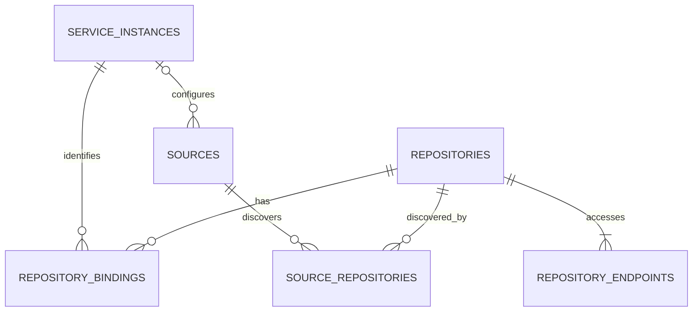

# リポジトリ識別と取得先（catalog3）

Repo IDはURLから独立したUUIDv4です。別プロトコルやマウントpathを同じrepoの取得先として明示登録できます。
GitHub、GitLab、Gitea、Forgejo、Gitolite、plain Git、その他のサービスをinstance単位で表現します。

| 実体 | 識別・関係 |
|---|---|
| `repositories` | 内部UUIDv4。repoのカタログ上の同一性 |
| `service_instances` | portable名前空間のUUIDv4、service_kind、重複可能なローカル表示name、任意のweb/API base URL |
| `repository_bindings` | repoとinstanceの対応。native IDは文字列またはNULL。`UNIQUE(service_instance_uuidv4, provider_repository_id)` |
| `repository_endpoints` | 内部UUIDv4、repo、Git URL、transport、label、優先指定。`UNIQUE(repository_uuidv4,url)` |
| `sources` | 発見・列挙の設定と任意のinstance参照。API tokenは環境変数名で参照 |
| `source_repositories` | sourceとrepoの多対多関係、最初と最後の発見時刻 |
| `git_acquisitions` | 取得・解析run。使用endpoint IDとURLを保持 |



CSPRNGから生成した正規小文字UUIDv4を `service_instance_uuidv4` として保持します。UUIDv5や任意文字列は受け入れません。UUIDの形式検査だけで原発行時の乱数源を証明できるわけではありません。異なるUUIDはURLが同じでも自動統合せず、実装済みの単一repository export/importでも同じ名前空間を維持します。provider IDがあるrepositoryのportable identityは `(service_instance_uuidv4, provider_repository_id)` です。

instance UUIDにより、同じhost上の別port/base pathや別オンプレ環境のnative IDを区別します。
URL、DNS alias、同じcommit、同じ内容はrepo統合の根拠にしません。forkや独立mirrorは別Repo IDで登録できます。
同じinstanceとnative IDを再発見した場合は既存Repo IDへ結び付けます。同じURLの別登録は、`--repo`等の明示指定がなければ別Repo IDになります。
Git-only登録を後からAPI管理repoへ結び付ける場合も、既存Repo IDへbindingを追加できます。

## SSH/HTTPSとローカルの別path

以下の`REPO_ID`と`ENDPOINT_ID`は各コマンドが返したUUIDに置き換えます。stateは初期化済みとします。

```bash
repo-catalog --state-dir /path/to/state sources add git-url \
  --name app --url git@code.example.net:team/app.git
repo-catalog --state-dir /path/to/state discover
repo-catalog --state-dir /path/to/state repos list
repo-catalog --state-dir /path/to/state endpoints add --repo REPO_ID \
  --url https://code.example.net/team/app.git --label https
repo-catalog --state-dir /path/to/state endpoints list --repo REPO_ID
repo-catalog --state-dir /path/to/state sync git --repo REPO_ID --endpoint ENDPOINT_ID
```

同じvolumeを別マウント経由で取得するときも同様です。

```bash
repo-catalog --state-dir /path/to/state endpoints add --repo REPO_ID \
  --url file:///mnt/network/team/app.git --label network-mount --preferred
repo-catalog --state-dir /path/to/state sync git --repo REPO_ID
```

相対pathは登録時の作業directoryから絶対file URIへ変換し、symlinkは解決しません。登録したマウントの表記を保持します。
`endpoints prefer`でも優先取得先を切り替えられます。初回endpointは自動的に優先され、repoに優先endpointは1件です。
新しいrunは開始時に取得先を固定するため、優先先を変更しても実行済み・中断済みrunの来歴は変わりません。
同じrepo内のキャッシュを再利用し、取得先が変わっただけでGit objectやdigestを複製しません。

別sourceとしても登録する場合は、既存Repo IDを指定します。

```bash
repo-catalog --state-dir /path/to/state sources add git-url --name network-view \
  --url file:///mnt/network/team/app.git --repo REPO_ID
repo-catalog --state-dir /path/to/state discover --source SOURCE_ID
repo-catalog --state-dir /path/to/state repos list --source SOURCE_ID
repo-catalog --state-dir /path/to/state sync git --source SOURCE_ID
```

Git URL sourceを指定したsyncはそのsourceのURLを使います。省略時はrepoの優先endpointを使います。
SSHの鍵・agent・host alias・非標準port・ProxyJump、HTTPSの認証は既存Git/OpenSSH/credential helper設定を利用します。
DBへ資格情報の秘密値を保存しません。

## サービス内の識別

```bash
repo-catalog --state-dir /path/to/state instances add gitlab --name corp-gitlab \
  --web-base-url https://code.example.net/gitlab \
  --api-base-url https://code.example.net/gitlab/api/v4
repo-catalog --state-dir /path/to/state repos bind --repo REPO_ID \
  --instance corp-gitlab --provider-repo-id 42
repo-catalog --state-dir /path/to/state repos show --repo REPO_ID
```

native IDが不明なら`--provider-repo-id`は省略可能です。同じinstance内で同じnative IDを別repoへ結び付ける操作は`IDENTITY_CONFLICT`として拒否します。
既存repoを合併するコマンドはありません。誤った対応を自動的に上書きしません。
service_kind/base URLの登録はAPI adapterの実装や実接続試験を意味しません。

GitHub API sourceはinstanceとtoken参照を選べます。表示名が曖昧な場合はinstance UUIDを指定します。REST/GraphQL接続先は選択した登録のURLと明示的なSource設定から決まり、表示名の変更では変わりません。既定instanceの自動登録時には、その時点の設定済みREST/GraphQL URLを保存します。後からグローバル設定を変更しても既存instanceを別接続先へ向け直しません。

```bash
repo-catalog --state-dir /path/to/state instances add github --name corp-github \
  --web-base-url https://github.example.net \
  --api-base-url https://github.example.net/api/v3
repo-catalog --state-dir /path/to/state sources add github --owner team \
  --instance corp-github --token-env-var CORP_GITHUB_TOKEN
```

同一instanceを複数source・アカウントで列挙してもnative IDによりRepo IDを再利用します。
API通信設定とtoken参照はsourceごとに選択し、条件付きGET・増分checkpointを別sourceから混用しません。
GitHub互換APIのinstance分離はloopback fixtureで検証しています。実GHESやGitLab/Gitea/SSHの接続試験は別途必要です。
GitLab/Gitea/Forgejoの自動列挙・MR/PR収集adapterは未実装です。共通データモデルは binding/request-kind ごとの番号空間を持ちます。Git-onlyはPRを`not_applicable`、対応サービスのbindingがあるのに利用可能なAPI sourceがない場合は`PROVIDER_UNSUPPORTED`/partialを返します。
1つのRepo IDに複数GitHub instanceを結び付けた場合も、サービスごとのPR番号空間の分離は後続範囲なのでPR収集は`PROVIDER_UNSUPPORTED`とします。Gitの複数取得先は利用できます。

## Issue・レビューの識別と交換

schema 14 の通常Issueは `(service_instance_uuidv4, provider_resource_id)` で恒久的に識別します。`issue_resources` の物理キーには `kind` も含め、Issueとコメントの同じ数値IDを区別します。現在の `repository_uuidv4`、binding、`provider_issue_number` は所属情報で、Issue移管時も恒久IDを取り替えません。コメントは同じserviceの型付きIssue親を参照します。

レビュー概要とレビューコメントは `review_resources` の `(change_request_id, kind, provider_change_request_document_id)` で識別します。review所属・reply先・独立thread所属を別々に保持し、PR・repository・binding・serviceの整合性を検査します。REST `id` とGraphQL `fullDatabaseId` を正規の正整数10進文字列として照合し、Node IDを代替キーにしません。threadのprovider IDは従来どおりPR内にscopeされたopaque値です。

交換では一つのrepositoryと必要な親・本文・完全性証拠を運び、同じ現在状態キーの正当な更新は可変状態の受理規則へ渡します。不変UUIDの衝突保護は他の履歴へ維持します。未到着の親や順序不明の競合をstagingへ残し、受信順でwinnerを作りません。Source-wide inventory、receiver-local trust/configuration、任意通信archiveは交換しません。詳細は[データモデル](data-model.md)と[実装対応表](latest-state-transport-implementation.md)を参照してください。

旧v2 importerとfinalizeは廃止済みです。D2は `not_applicable / retired` とし、歴史的なreceiptは保存します。不明なID・親・観測時刻を捏造しない契約は現行の収集・交換にも適用します。
