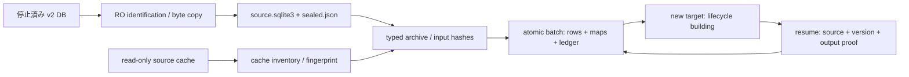

# P2 オフライン変換基盤

対象は PR #1 / `design/schema-v2-hardening`。開始時にremoteをfetchし、PR/feature HEADは `84416f90cd1d06b87c605545ecf730cbda75165b`、mainは `9a4110185d7e7abffc291f9cfd118ca71587f998` と確認した。直近のP1 CI（PR run `37345555942`、push run `37345549896`）はいずれもsuccessで、後続修正はなかった。

P2は **synthetic入力で検証したarchive・ID map・batch/resume基盤**。実DBと旧cacheは開いていない。通常application/migration runner、001/002 migration、P1 DDL・変換契約・生成ビューは変更しない。targetは74 STRICT tables / 426 columns、format `repo-catalog/catalog3-p1` / version 3、DDL SHA-256 `fd39297f3b73abc190aa82a28164f2d496048d773cbbcc9039a54972046a5709` のまま。

## 実行境界と構成

専用commandは `scripts/offline_convert.py`。通常sync・hydrate・restore・API/Git adapterを呼ばない。Linux x86_64/aarch64、CPythonのaudit対応SQLite binding、SQLite >=3.46.1を要求する。非対応なら開始を拒否する。



| component | 責務 |
|---|---|
| `scripts/conversion/source.py` | sealing、v2構造・migration・identity照合、immutable RO、cache inventory |
| `guards.py` | fresh workerの不可逆seccomp/audit policy、入力/外部write拒否 |
| `archive.py` | 全source列のexact extraction、P1 TLV/key/hash、bounded row batches |
| `target.py` | 独立DDL、新DB identity、writer OS lock、format/DDL/contract/code照合 |
| `mapping.py` | typed target key、存在確認、stable allocation、衝突拒否 |
| `batch.py` | transaction前のproof準備、SQL-only commit、committed output照合 |
| `engine.py` | capacity→source照合→ledger照合→未確定batch→pause。公開入口はpolicy必須の`run` |
| `capacity.py` / `diagnostics.py` | 容量前提、blocking/partial/infoの分類と保存 |

component関数を直接呼ぶsynthetic unit testはあるが、運用入口の代替にはしない。不可逆guardをapplicationやpytest親processへ入れない。policyはworker単位の不変値で、process-globalなsync状態やfixture順に依存しない。

## 入力のsealと不変性

1. アプリを停止し、checkpoint済み・close済み・sidecarなしのv2 DBを準備する。live WAL、SHM、rollback journalがあれば拒否する。converter自身は元DBのcheckpoint、backup API、journal削除をしない。live DBからのcopyはこの実装の対応外で、運用側で整合した停止済み入力を準備する。
2. 実構造fingerprintを `conversion-contract.json` の `source_schema_sha256` と照合する。現在は53表/287列の基準構造のみ。001/002の両migration checksumとversion、catalog identityも照合する。checksumを書換えない。
3. 元fileのdevice/inode/size/mtime/ctimeとSHA-256を前後で確認し、専用workspaceへbyte copyする。copyのSHA/schema/identity一致、fsync、read-only mode、rename、descriptor保存を経て入力とする。
4. source DBは `mode=ro&immutable=1`、`query_only=ON`、write/ATTACH拒否authorizer、extension無効、tempはmemoryで開く。conversion時にも元DB/copy/cacheのfingerprintを再照合する。同じbytesでも元fileのinode置換は拒否する。

seal済みcopy、元DB、cache、`sealed.json` はresume中の固定入力。元DB/cacheを消したり移動したりした後のportable resumeはP2の対応外。DB/cachesはlocal filesystemに限定し、NFS/CIFS/FUSE等の未知/remote filesystem、symlink cache、special fileは拒否する。cacheは全regular fileとdirectoryのpath bytes、stat、file SHAを保存し、Git commandを実行しない。alternates/promisorのclosure回復やcache portabilityはP4で定義する。

実行時追加FTS virtual/shadow tables、view、ANALYZE内部表、独自index/DDL等を含むv2は、現時点では **unsupported schemaとして停止**。それらを捨てて53表だけ移すことはしない。known derived schemaの認識・archive範囲拡張はP3へのblocking引継ぎ事項。

## 通信・write拒否

guardはDBを開く前に導入する。新規socket/connect/send/receive、exec/fork/clone、io_uringをkernel seccompで拒否する。標準FDがsocketなら拒否し、その他の継承FDを閉じ、既存threadがあれば拒否する。Git fetch/gc/prune/update-ref/cat-fileを含む全子processが起動できず、lazy/promisor retrievalもできない。Python socket/HTTP/process入口もauditで拒否する。loopback APIもconverterでは許可しない。

Python file mutationはworkspace以外とsource/cache/sidecarを拒否する。audit eventにdir_fdが含まれないopen経路はseccompでFD相対openを拒否し、rename/chmod等のFD相対mutationも拒否する。SQLiteの第二の誤ったwrite connectionはauditで拒否する。接続audit eventのないbindingはfail closed。これは固定したtrusted converterコードの誤writeを防ぐ仕組みで、任意native plugin実行用のfilesystem sandboxではない。native extension loadingを禁止し、運用にpluginを追加しない。

workspaceのwritable regular fileはlink count 1を要求し、hardlink作成も拒否する。`resolve()`だけでは既存hardlinkが原本/cacheと同じinodeを共有していることを検出できない。`a0f5b8b9bb49675010843a17d51ac10ad8c418e6`でsource/cache aliasへのPython writeと、停止済みWAL-format sourceを`target.sqlite3`にhardlinkした場合のheader変更をsyntheticで再現した（3 failed）。修正後は接続/書込み前に拒否し、原本bytes/statが変わらないことを検証する。target/workspaceのhardlinked filesは未対応で、解除のため原本へ操作しない。

依存準備は別process/別工程。`prepare_wheelhouse.py`、`prepare_sqlite_minimum.py` はonline準備で、converter/validatorから参照・実行しない。

## exact archiveとidentity

P1契約が正本。全source tableをPK順、全列をschema順で読む。`typeof`と、TEXT/BLOBの`CAST(... AS BLOB)`で取得し、TEXTを先にdecodeしない。NULLは空bytes、INTEGERはsigned decimal ASCII、REALはIEEE754 binary64 big-endian、TEXT/BLOBはSQLiteが返すexact bytes。元DBのphysical bytes全体はsealed copyにも残る。

source keyはPK ordinal順の型tag + uint64長 + bytes TLV。NULL/空、整数/実数/文字/bytes、複合値境界を区別する。row hashはP1 `row_digest`。`legacy_records(source_id,table,key)`と`legacy_values(record_id,column)`へ全列を保存し、契約の287列対応を実構築targetと照合してから実行する。archiveの観測行は本文が同じでも消さない。

`id_mappings`はtyped target PKを保存し、targetの存在・型・identityの両方向衝突を検査する。既存mapは再利用し、違うkeyへ再割当しない。UUIDv4の生成は未割当時だけで、committed allocationはrestart後にも同じ。P2の代表projectionは明示optionのrepository `id/name/metadata`だけ。既存local IDを維持し、current pointerは設定しない。その他の全値はarchiveに残る。これはP3のrepo/binding/endpoint正規化完了ではない。

## batch、pause、resume

単一writer OS lockの下で入力hash、row plan、ID候補、診断event時刻、出力proofを **BEGIN前** に作る。batch transactionではarchive、代表entity、map、診断、`conversion_batches`、run進捗をSQLだけで保存する。SHA計算・Git・通信・stdout中にwrite transactionを保持しない。DELETE journal / synchronous EXTRA、COMMIT後を確定境界とする。

ledgerのinput hashはsealed SHA/table/batch index/全source key+row hashを含む。output manifestは全出力rowのtyped値hashとPKを持つ。本文bytesをmanifestへ重複格納しない。empty tableにもbatch証跡を残す。resumeは全source batchを再fingerprintし、確定済みledgerがそのprefixであること、各output rowの全値、余分なarchive/entity/mapがないことを確認する。row番号や件数だけで成功を判定しない。

resumeではsource/schema/migration/cache、target実DDL、DDL hash、contract bytes hash/version、parser version、converterコードhash、batch optionを照合する。現在の互換性規則は **exact code/hash/version match**。SQLite/Pythonは対応runtimeを使う。互換parserの範囲緩和はまだない。COMMIT前の例外/killはrollback（kill後のhot target journalはSQLiteのtarget recovery）、COMMIT直後のkillは既存batchのproofを認識して重複なしで続ける。

`--max-batches`でpause可能。全archive batchを保存してもrunは`paused`、target lifecycleは`building`。`archive_complete`はarchive範囲の完了だけで、`validated`/activeを意味しない。P3開始後にdomain rowを変更する場合はphase handoffを明示し、P2の現在値proofを無条件に再利用しない。

## 容量と失敗

preflightはsource bytes + 4×(exact payload + 256 bytes/列 + 512 bytes/行 + seal/cache metadata) + 64 MiBを要求する。sealed copy、新target archive、B-tree/index、journal/tempの余裕を含む概算で、cache copyとP3全domainの容量保証ではない。seal前とtarget作成/継続前に空きを確認する。targetは新規exclusive fileで作り、sourceも既存destinationも上書きしない。

invalid boolean/state/JSON、malformed text、missing FKはarchiveを残してblocking診断。partial acquisition、opaque payloadの未replayはpartial診断。sourceの観測時刻はtyped archiveでそのまま保持し、converterのrun/diagnostic/batch時刻と分ける。completion、latest、ownership、provenanceは推測しない。

| 失敗 | 結果 |
|---|---|
| source format/schema/migration、不整合sidecar、unsupported FS | seal/開始を拒否。元source変更なし |
| source/cache/DDL/contract/code変更、破損したprior proof | continuationを拒否。既存targetをactiveにしない |
| invalid legacy semantics | `validation_results`にblocking/partial。元の全値をarchive |
| COMMIT前例外/kill、SQLITE_FULL | 当該batch未確定。既存ledgerだけが再開根拠 |
| COMMIT後のkill | committed batchを検出しskip。観測やmapを重複保存しない |
| operational errorで診断DB writeも不可能 | command stderrのcode/severity、exit 2で明示。成功/completeを返さない |

CLIはpayload/URL/認証情報をerrorに含めない。中断したsealの`.part`/descriptor不在は自動補正しない。元入力を保全して新workspaceでやり直す。target hot journalの回復にはarchive commandを再実行し、read-only verifyで消さない。

## synthetic実証と使い方

```bash
# 専用synthetic sourceを用意した場合のみ。この工程で実DBは扱わない。
uv run --no-sync python scripts/offline_convert.py seal \
  --source artifacts/synthetic-v2.sqlite3 --source-cache artifacts/synthetic-cache \
  --work-dir artifacts/synthetic-conversion
uv run --no-sync python scripts/offline_convert.py archive \
  --work-dir artifacts/synthetic-conversion --batch-size 100 --max-batches 10
uv run --no-sync python scripts/offline_convert.py archive \
  --work-dir artifacts/synthetic-conversion --batch-size 100
uv run --no-sync python scripts/offline_convert.py verify --work-dir artifacts/synthetic-conversion
```

`--representative-repositories`を使った場合はresumeでも同じoptionを指定する。通常CLIへの登録やapplication起動でのformat切替はない。

`test_conversion_foundation.py`は全source表/列のbytes比較、5型、scalar/composite key、malformed UTF-8、A→B→A/同本文別観測、invalid flag/state、missing FK、partial/complete collection、未関連payload、同OID複数refを使う。再開は六地点のfault、`os._exit`、actual SQLITE_FULL、source replacement、DDL/contract/parser/code/output mismatchを検証する。guardはPythonとraw libcのsocket/exec/FD相対openを実行して拒否を確認する。P1全不変条件試験と3件の旧v2characterizationも維持する。

最小SQLite laneではCPython 3.12.14標準bindingと固定SQLite 3.46.1をhash確認済みソースから準備する。旧`pysqlite3-binary`は接続auditがなく、P2保護の試験を通せなかったため採用しない。組込み`_sqlite3`のあるPythonでもextensionを明示loadする。固定4 workerもtest import前に同じbindingをloadし、実versionを確認する。native SQLiteが下限未満のCIでは、converter subprocessは準備した3.46.1で試験し、そのversionも照合する。native laneのP1試験を消さない。

## P3〜P7への引継ぎ

- P3: FTS等のknown source構造追加、全productionのrecipe/lookup/allocation/persistence、domain ownershipとcurrent pointer、phase handoff、archive→domain比較proof。代表repo mapだけで全conversion済みと扱わない。
- P4: 保存REST/GraphQL page・unresolved payloadとGit rawのoffline再解析、root origins、stable listing、cryptographic admission、search/index rebuild。原文不在は診断し取得しない。
- P5: completion/watermark/validator/page/cursorをtyped scopeへ回復、first syncの限定resume、新runtime/CLI接続。
- P6: 別途対象を定めて実データのsealed dry-run、容量/性能/照会/未解決decisionの非公開検証。
- P7: validated gate後の運用切替/rollback。実DBの切替、自動mergeは今回行わない。

P2 synthetic成功は実データmigrationの成功証明ではない。CI計測と結果は[CI性能](../ci-performance.md)へ記録する。

## 確認した実装とgate

code SHA `ff4de5ff64451cd12e7252f18a7f89e1ffd14d54`でRuff check/format、契約287列/74表、FTS、doctor、build/export、normal319件+offline packaging2件（全321 IDs）、SQLite3.46.1 lane228件、offline-recovery demoをローカルと[CI run 37372043596](https://github.com/TakashiSasaki/git-repo-db/actions/runs/37372043596)で確認した。local native SQLiteは3.53.1、CI nativeは3.45.1で、converterとminimum laneは対応bindingを確認する。最終文書記録のcommitではconverter/DDL/契約コードを変えず、そのHEADのchecksも確認する。exact SHAと後続のCI結果はPR #1のvalidation記録に残す。
